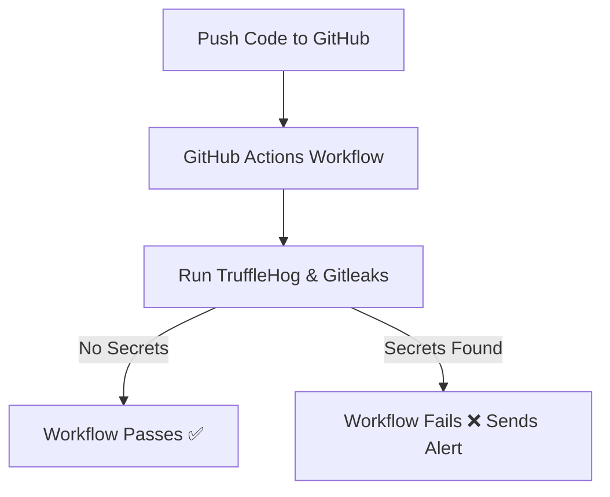

# 🔐 Secrets Scanning in CI/CD with GitHub Actions

This project demonstrates how to integrate **automated secrets scanning** into a GitHub Actions pipeline using **TruffleHog** and **Gitleaks**. It detects hardcoded credentials in commits and notifies a **Discord channel** if secrets are found, preventing insecure code from being merged.

---

## 📌 Features

* ✅ Automated **secrets scanning** in CI/CD pipeline
* ✅ **TruffleHog** for entropy-based and regex-based secret detection
* ✅ **Gitleaks** for pattern-based secret detection
* ✅ **Discord webhook alerts** when secrets are detected
* ✅ GitHub Actions **blocks merges** if secrets are found

---

## 🛠 Tools Used

* [GitHub Actions](https://docs.github.com/en/actions) – CI/CD pipeline
* [TruffleHog](https://github.com/trufflesecurity/trufflehog) – Secrets scanner
* [Gitleaks](https://github.com/gitleaks/gitleaks) – Secrets scanner
* [Discord Webhooks](https://support.discord.com) – Alert notifications

---

## 📂 Repository Structure

```
.
├── .github/workflows/secrets-scan.yml   # GitHub Actions workflow
├── src/app.py                           # Sample code with fake API key
├── .gitleaks.toml                       # Custom Gitleaks rules
├── README.md                            # Project documentation
└── images/                              # Screenshots for README
```

---

## ⚙️ How It Works



---

## 📸 Screenshots

### 🔹 1. Workflow Run

### 🔹 2. Workflow Failure on Secret Detection

### 🔹 3. Discord Alert Example

### 🔹 4. TruffleHog Detection Output

---

## 🚀 Setup Instructions

### 1️⃣ Clone the Repository

```bash
git clone https://github.com/YOUR_USERNAME/secrets-scanning-demo.git
cd secrets-scanning-demo
```

### 2️⃣ Install TruffleHog

```bash
pip install trufflehog
trufflehog --regex --entropy=True --json .
```

### 3️⃣ Install Gitleaks

```bash
brew install gitleaks
gitleaks detect --source . --verbose
```

### 4️⃣ Configure Discord Webhook

* Create a webhook in your Discord channel settings
* Add the webhook URL to `.github/workflows/secrets-scan.yml`

### 5️⃣ Push Code to Trigger Scan

```bash
git add .
git commit -m "test secret scan"
git push origin dev
```

---

## 📜 Security Policy

See [SECURITY.md](SECURITY.md) for secret handling best practices and remediation steps when leaks are detected.

---

## 📊 Example Use Cases

* Secure SDLC pipelines
* Demonstrating DevSecOps practices
* Preventing credential leaks in repositories

---

## 📌 Next Steps

* Add more secret detection rules in `.gitleaks.toml`
* Integrate with **Slack or Teams** as additional alert channels
* Use **AWS/GCP secret scanners** for cloud-specific keys

---

## 👤 Author

Ali El-Asmar

---

## 📄 License

This project is licensed under the MIT License.
